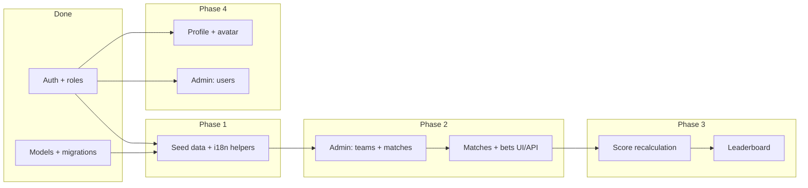

# Development Plan — World Cup Pool 2026

This document outlines the recommended build order for core product features. It assumes the current foundation is in place: JWT auth (access + refresh, Redis blacklist), domain models (`User`, `Team`, `Match`, `Bet`), scoring/bet-lock logic, dual routing (HTMX web + REST API), and Alembic migrations.

---

## Recommended order

Bets and the leaderboard depend on matches; matches depend on admin (or seed) data. Profile is largely independent and can be built in parallel after auth.

---

## Phase 1 — Shared foundations

**Goal:** Reusable building blocks every feature will need.

| Item | What to build |
|------|----------------|
| Datetime formatting | Jinja filter + API helper: UTC → user `timezone` / `locale` |
| Dev seed command | Alembic seed script or `make seed`: sample teams, a few matches, one admin user |
| Route layout | Split `app/web/` into `matches.py`, `profile.py`, `leaderboard.py`, `admin/` |
| API layout | Mirror under `app/api/v1/`: `matches.py`, `bets.py`, `leaderboard.py`, `users.py`, `admin/` |
| OpenAPI hygiene | `include_in_schema=False` on HTMX-only web routes so `/api/v1/docs` stays REST-focused |

**Tests:** Datetime formatting, seed smoke test.

**Exit criteria:** Log in as seeded user; admin exists; matches are queryable from the database.

---

## Phase 2 — Admin: teams & matches

**Goal:** Admins can populate the tournament so regular users have something to bet on.

### REST (`get_current_admin`)

| Endpoint | Purpose |
|----------|---------|
| `GET/POST /api/v1/admin/teams` | List / create teams |
| `GET/PATCH/DELETE /api/v1/admin/teams/{id}` | Update / remove |
| `GET/POST /api/v1/admin/matches` | List / create matches |
| `GET/PATCH/DELETE /api/v1/admin/matches/{id}` | Edit kickoff, stage, group; set final scores |
| `PATCH /api/v1/admin/matches/{id}/result` | `home_score`, `away_score` → triggers scoring (Phase 4) |

### Web (HTMX admin pages)

- `/admin` — dashboard (links to teams, matches, users)
- `/admin/teams` — table + create/edit forms (HTMX partial swaps)
- `/admin/matches` — create match (home/away team, kickoff, stage, group)

### Model tweaks (if needed)

- `Match`: optional `venue`, `match_number` (ordering)
- Validation: `home_team_id != away_team_id`; kickoff in the future when creating

**Tests:** Admin-only access (403 for `user`), team/match CRUD, validation.

**Exit criteria:** Admin can create e.g. “Brazil vs Argentina” with a kickoff time; it appears in the database.

---

## Phase 3 — Matches page + betting

**Goal:** Users see upcoming matches and submit predictions before lock.

### REST

| Endpoint | Purpose |
|----------|---------|
| `GET /api/v1/matches` | Filter: `stage`, `group`, `upcoming`, `with_bets` |
| `GET /api/v1/matches/{id}` | Match detail + user’s bet if any |
| `PUT /api/v1/matches/{id}/bets` | Create/update bet (`home_score`, `away_score`) |
| `GET /api/v1/bets/me` | All current user’s bets |

### Web (`/matches`)

- List grouped by date or group stage (mobile-first cards)
- Each card: teams, localized kickoff, lock countdown, score inputs
- HTMX: `hx-post` bet → swap `partials/match_card.html`
- Locked state: inputs disabled when `is_bet_locked(kickoff, now)`; show lock time in user TZ

### Business rules

- Reject bet if locked or match already has final scores
- User can only bet on own rows (`user_id` from `request.state.user`)
- Score bounds (e.g. 0–20) in Pydantic
- Use existing `app/core/bet_lock.py` and `app/core/scoring.py`

**Tests:** Bet before lock ✓; bet at lock ✗; update own bet ✓; wrong user ✗.

**Exit criteria:** User places bets on seeded matches; locked matches show read-only UI.

---

## Phase 4 — Scoring + leaderboard

**Goal:** When admin enters a result, points update; everyone sees rankings.

### Scoring service

On `PATCH .../matches/{id}/result`:

1. Save `home_score` / `away_score`
2. For each bet on that match: `bet.points = calculate_bet_points(...)`
3. Commit in a single transaction

**v1:** Compute `SUM(bets.points)` per user in queries (no denormalized `total_points` yet).

### REST

| Endpoint | Purpose |
|----------|---------|
| `GET /api/v1/leaderboard` | Ranked list: `display_name`, `avatar_url`, `total_points`, tie-breaker |
| `GET /api/v1/leaderboard/me` | Current user rank + points |

### Web (`/leaderboard`)

- Top 3 highlight (gold / silver / bronze styling)
- Full table: rank, name, avatar, points
- “You are #N” for logged-in user

**Tests:** Exact score = 3 pts; correct result = 1 pt; wrong = 0; leaderboard order; ties.

**Exit criteria:** Admin sets a result → leaderboard updates on refresh.

---

## Phase 5 — Profile page

**Goal:** Users manage their own account.

### REST (`get_current_user` — own profile only)

| Endpoint | Purpose |
|----------|---------|
| `GET /api/v1/users/me` | Profile (or extend `/auth/me`) |
| `PATCH /api/v1/users/me` | `display_name`, `locale`, `timezone` |
| `POST /api/v1/users/me/password` | `current_password`, `new_password` |
| `POST /api/v1/users/me/avatar` | Multipart upload → store file → set `avatar_url` |

### Web (`/profile`)

- Form: display name, locale, timezone
- Change password section
- Avatar upload (`multipart/form-data`, HTMX or standard form post)

### Avatar storage

| Approach | When |
|----------|------|
| Local `uploads/avatars/` (Docker volume) | **Start here** — simple for single EC2 |
| S3 + CloudFront | Later (see README future work) |

Validate: image type (JPEG/PNG/WebP), max size (e.g. 2 MB), safe filenames.

**Tests:** Update profile; wrong current password rejected; avatar upload updates URL.

**Exit criteria:** User changes display name and avatar; visible on leaderboard and header.

---

## Phase 6 — Admin: user management

**Goal:** Admins manage pool membership.

### REST

| Endpoint | Purpose |
|----------|---------|
| `GET /api/v1/admin/users` | Paginated list; filter by `is_active`, `role` |
| `GET /api/v1/admin/users/{id}` | User detail + bet stats |
| `PATCH /api/v1/admin/users/{id}` | `role` (`user` / `admin`), `is_active` |

Prefer **deactivate** (`is_active=false`) over hard delete.

### Web (`/admin/users`)

- Searchable table
- Toggle active / promote to admin (HTMX confirm)

### Safety

- Admin cannot demote or deactivate themselves
- Optional: at least one active admin must remain

**Tests:** Promote user; deactivated user cannot log in; non-admin gets 403.

**Exit criteria:** Admin can promote a user and deactivate an account.

---

## Phase 7 — Polish & production readiness

| Item | Notes |
|------|--------|
| Navigation | Unified header: Matches, Leaderboard, Profile; Admin only if `role == admin` |
| Home `/home` | Redirect to `/matches` or show summary (next match, your rank) |
| Error pages | Friendly HTML for 404 / 403 |
| API docs in prod | Disable `/api/v1/docs` when `APP_ENV=production` |
| Bootstrap admin | `make seed` or env `BOOTSTRAP_ADMIN_USERNAME` |
| Email / password reset | Out of scope until SES (see README) |

---

## Milestones (suggested PRs)

| Milestone | Scope |
|-----------|--------|
| **M1** | Phase 1 + Phase 2 — seed data, admin teams/matches |
| **M2** | Phase 3 — matches list + betting (web + API) |
| **M3** | Phase 4 — scoring on result entry + leaderboard |
| **M4** | Phase 5 — profile + avatar upload |
| **M5** | Phase 6 + Phase 7 — admin users, nav polish, production tweaks |

Each milestone should include: REST endpoints, HTMX pages where applicable, and focused tests per `.cursorrules`.

---

## Explicitly deferred

- Knockout bracket / group standings tables
- Live scores from external APIs
- Email notifications and password reset
- S3, ASG, RDS (documented in README as future work)
- SPA or heavy client-side JavaScript

---

## Next step

**Start with M1:** seed script + admin CRUD for teams and matches. Without match data, bets and leaderboard cannot be exercised end-to-end.
